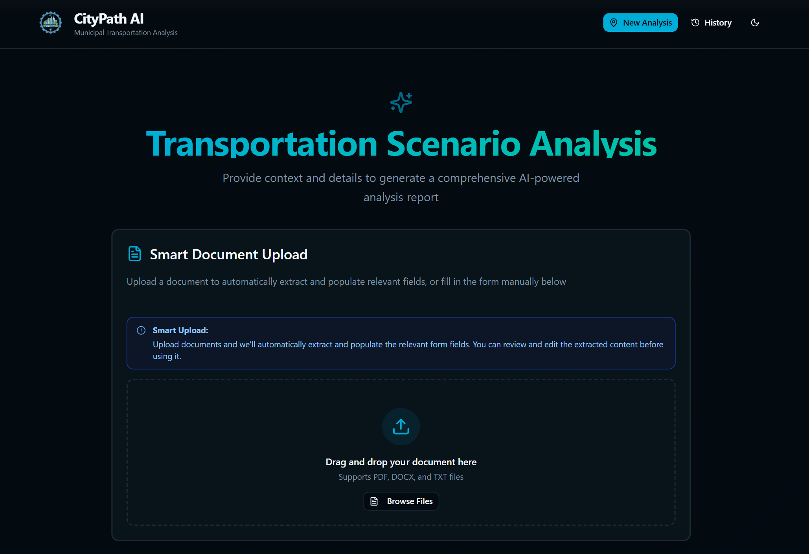
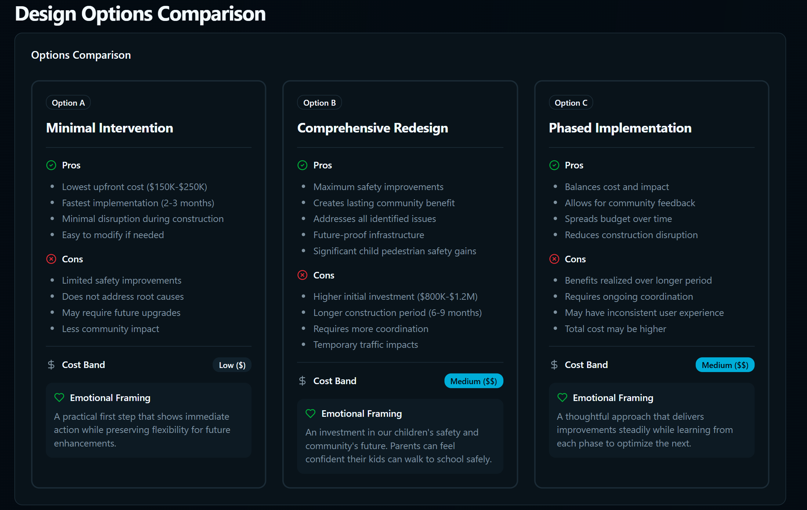
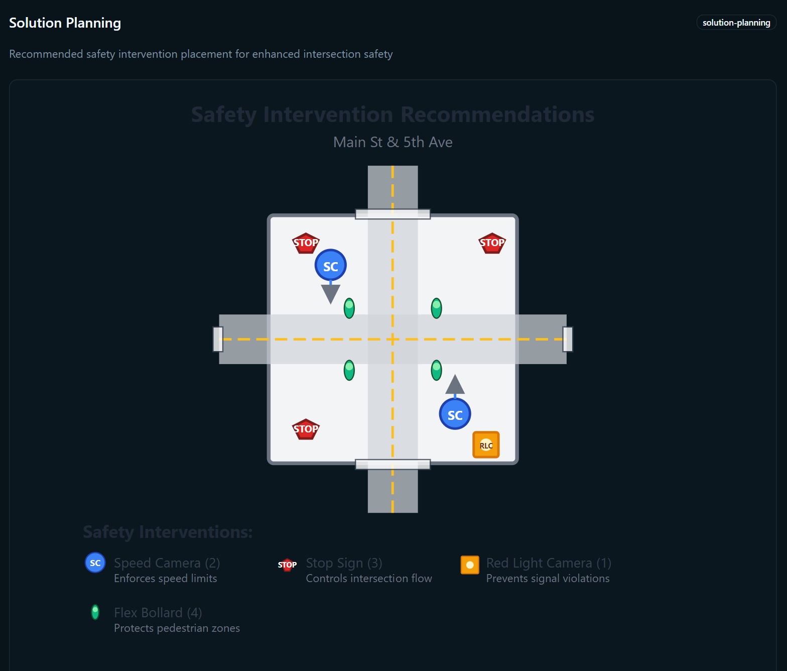

# CityPath AI  
Municipal Transportation Scenario Analysis Tool

CityPath AI is a full-stack web application built to explore how AI-assisted analysis can support municipal transportation planning. The tool allows users to input city context and transportation scenarios and generates structured, report-style analysis focused on safety, mobility, and policy trade-offs.

This project was developed as a hackathon prototype to demonstrate how structured inputs, AI-generated reasoning, and lightweight visual outputs can be combined into a planner-facing decision support tool.

---

## What This Project Is
- A working **frontend + backend demo**
- A structured approach to transportation scenario analysis
- A proof-of-concept for AI-assisted municipal planning workflows

## What This Project Is Not
- A production-ready system
- A fully validated traffic simulation model
- A real-time data-integrated platform

This distinction is intentional.

---

## Core Capabilities
- Structured input workflow for transportation scenarios
- AI-generated written analysis in a report-style format
- Clear separation between frontend UI and backend logic
- Extensible design for future data integration and optimization

---

## Project Structure

citypath-ai/
 - frontend/   # Web interface for user inputs and report display
 - backend/    # Backend logic for analysis generation
 - spec.md     # Product design and feature specification
 - README.md

---

## How It Works (High Level)
1. User inputs city context, available data, and a transportation scenario
2. Inputs are sent to the backend for structured analysis
3. The backend generates a multi-section report-style response
4. Results are rendered in a clean, planner-facing interface

---

## Tech Stack
**Frontend**
- JavaScript
- Modern UI components for form-based input and report display

**Backend**
- JavaScript / Node-based backend
- AI-assisted analysis logic

**Other**
- Structured prompt design
- Modular architecture separating UI, logic, and specification

---

## Screenshots

**Scenario Input (Smart Document Upload)**  
Upload a document or manually provide context to automatically populate analysis fields.

**Design Option Comparison and Tradeoff Analysis**  
Side-by-side comparison of implementation options with cost, safety impact, and qualitative trade-offs.

**Safety Intervention Planning Visualization**  
Conceptual intersection diagram illustrating recommended safety interventions and placement.

---

## Design Documentation
The file `spec.md` contains the original product specification and feature roadmap, including:
- Planned visual generation
- Document upload concepts
- Safety intervention visualization ideas

Not all features in `spec.md` are fully implemented. It exists to document design intent and future direction.

---

## Project Context
Built during a hackathon focused on applying AI and analytics to real-world urban and municipal challenges.

---

## Author
Owen Li  
Management Engineering, University of Waterloo
